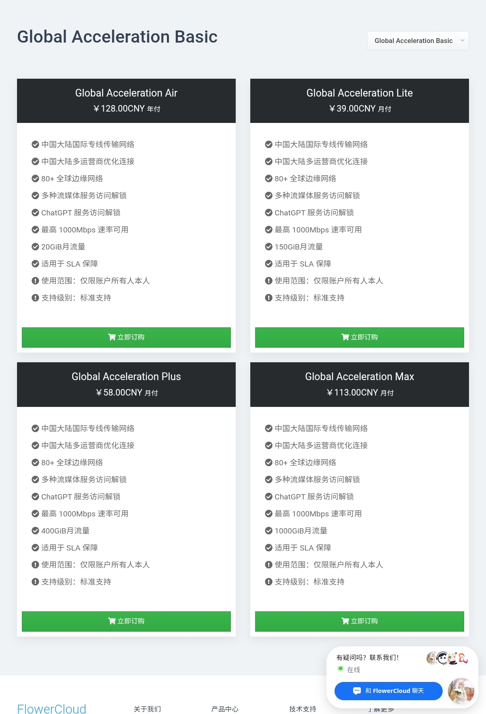
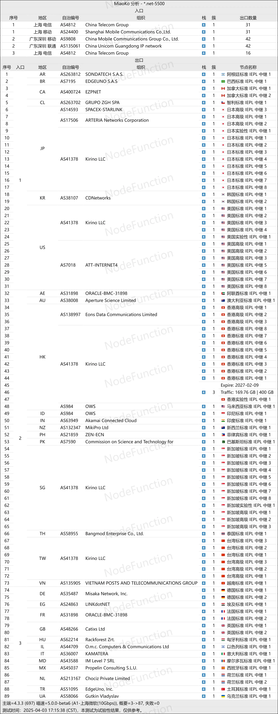

# 🌐 FlowerCloud 花云 - 顶级IEPL专线机场

先看我！自2026年4月起国内对“非法用于跨境联网”的机房进行了**巨大规模的清查**
大量专线和中转机场营业受到了**猛烈冲击**
因此推荐一些当今**稳定能用**并且**高速**的机场，我将其放在了本仓库[**特殊时期.md**](https://github.com/Travis0234/FlowerCloud-/blob/main/%E7%89%B9%E6%AE%8A%E6%97%B6%E6%9C%9F.md)中，强烈建议你看一看
前往👉[「特殊时期必看 稳定机场推荐」](https://github.com/Travis0234/FlowerCloud-/blob/main/%E7%89%B9%E6%AE%8A%E6%97%B6%E6%9C%9F.md)

---

**[👉 点击此处：前往🌸 FlowerCloud 官方注册地址](https://api-flowercloud.com/aff.php?aff=16382)**

**[👉 点击此处：前往🌸 FlowerCloud 官方注册地址](https://api-flowercloud.com/aff.php?aff=16382)**

**[🎉 我的个人博客：科学上网技术分享](https://travisblog.qzz.io/)**

### 📖 品牌介绍
* **官方名称：** FlowerCloud (花云)
* **Telegram 频道：** [t.me/flower_cloud](https://t.me/flower_cloud)
* **实时监控：** [节点在线状态监控](https://stats.uptimerobot.com/kX0l5hnGzz)
* **行业地位：** 知名电报频道 **“前女友机场测评”** 常年稳居一线，综合实力排名第四。

---

### ⚡ 技术规格与优势
* **顶级线路：** 采用 **京德、沪日、深港** 三条独立 IEPL 专线接入，无视高峰波动。
* **协议支持：** 全面支持 **SS (Shadowsocks)** 及 **Trojan** 协议。
* **软件兼容：** 完美适配 Clash, Surge, SS 等主流客户端。
* **福利节点：** 覆盖 4 个地区的 **0.2 倍率** 节点，流量耐用度提升 5 倍。
* **纯净落地：** 拥有多地区 **家宽（住宅）纯净 IP** 节点。
* **极速带宽：** 官方称限速 1000Mbps，实测最高可冲击 **2000Mbps** 极限带宽。

---

### 💰 套餐详情

---

### 📊 性能实测与分析

#### 1. 晚高峰测速表现

#### 2. 流媒体解锁报告
保障 **Disney Plus、Netflix、HBO Max、巴哈姆特动画疯** 等主流平台解锁，几乎实现全流媒体通杀。

#### 3. 节点链路分析

---

### 🚀 快速开始
1. **[点击这里注册 FlowerCloud 账号](https://api-flowercloud.com/aff.php?aff=16382)**
2. 根据您的设备下载对应客户端（Clash / Surge / SS）。
3. 导入订阅链接，享受极致专线体验！
